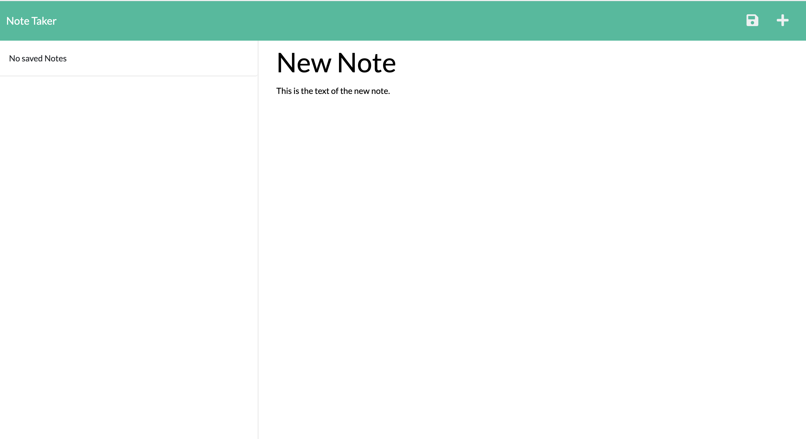
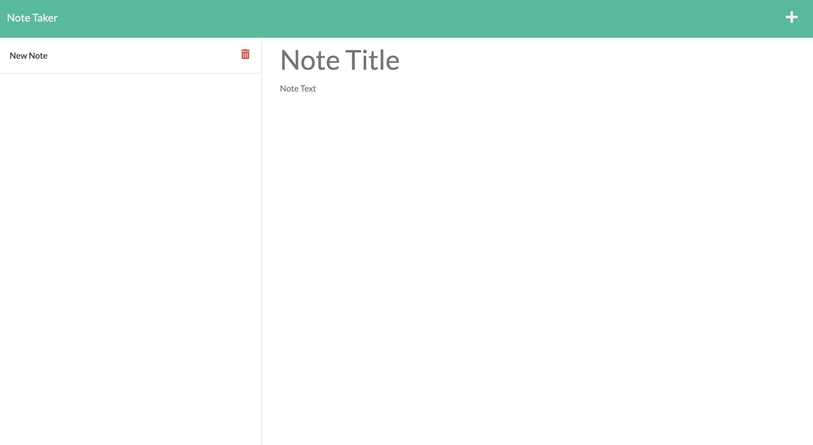

# note-taker

[](https://opensource.org/licenses/MIT)

  **Deployment Date:**  10/28/22 <br>

  **Deployed Link:** https://note-taker-sthoorens.herokuapp.com<br>
  
  **Technologies used:**  Node.js, JavaScript, Express.js, nodemon, Heroku<br>

  **Project goal:**  Create server code to save and retrieve note data from a JSON file and deploy a functioning note-taking app. <br>


  ## Table of Contents
  1. [Project Description](#Description)
  2. [Usage](#Usage)
  3. [Challenges Encounted](#Challenges)
  4. [Tests](#Tests)
  5. [License](#License)
  <br>
  
  ## Description

This project required coding an Express.js back-end to complete pre-written front-end code for a note-taking application. User enters new note tile and text content, saves the note to a list that populates on the page and can be deleted and removed from the list when the trash icon is clicked.

The information provided for this challenge:

## User Story

```
AS A small business owner
I WANT to be able to write and save notes
SO THAT I can organize my thoughts and keep track of tasks I need to complete
```


## Acceptance Criteria

```
GIVEN a note-taking application
WHEN I open the Note Taker
THEN I am presented with a landing page with a link to a notes page
WHEN I click on the link to the notes page
THEN I am presented with a page with existing notes listed in the left-hand column, plus empty fields to enter a new note title and the note’s text in the right-hand column
WHEN I enter a new note title and the note’s text
THEN a Save icon appears in the navigation at the top of the page
WHEN I click on the Save icon
THEN the new note I have entered is saved and appears in the left-hand column with the other existing notes
WHEN I click on an existing note in the list in the left-hand column
THEN that note appears in the right-hand column
WHEN I click on the Write icon in the navigation at the top of the page
THEN I am presented with empty fields to enter a new note title and the note’s text in the right-hand column
```

## Usage 
 
  This app can be viewed and used from this link: 
 https://note-taker-sthoorens.herokuapp.com/

## Deployed Screenshots

_<p align="center">With empty list on initial window load.</p>_
  

_<p align="center">With populated list after note saved.</p>_
 

  ## Challenges
 
 Determining the order in which Express reads the code was a challenge at the beginning. I also had trouble testing on the localhost while connected and required a lot of troubleshooting before understanding how to correctly connect.

  ## Tests

  No tests were written for this program.

  ## License

  Click the badge to learn more about the license used for this project.
  <br>[](https://opensource.org/licenses/MIT)

  ## Questions?

  Find me on GitHub at: https://github.com/sarahthoorens

  You can also send any questions about this project to: s.thoorens@gmail.com


